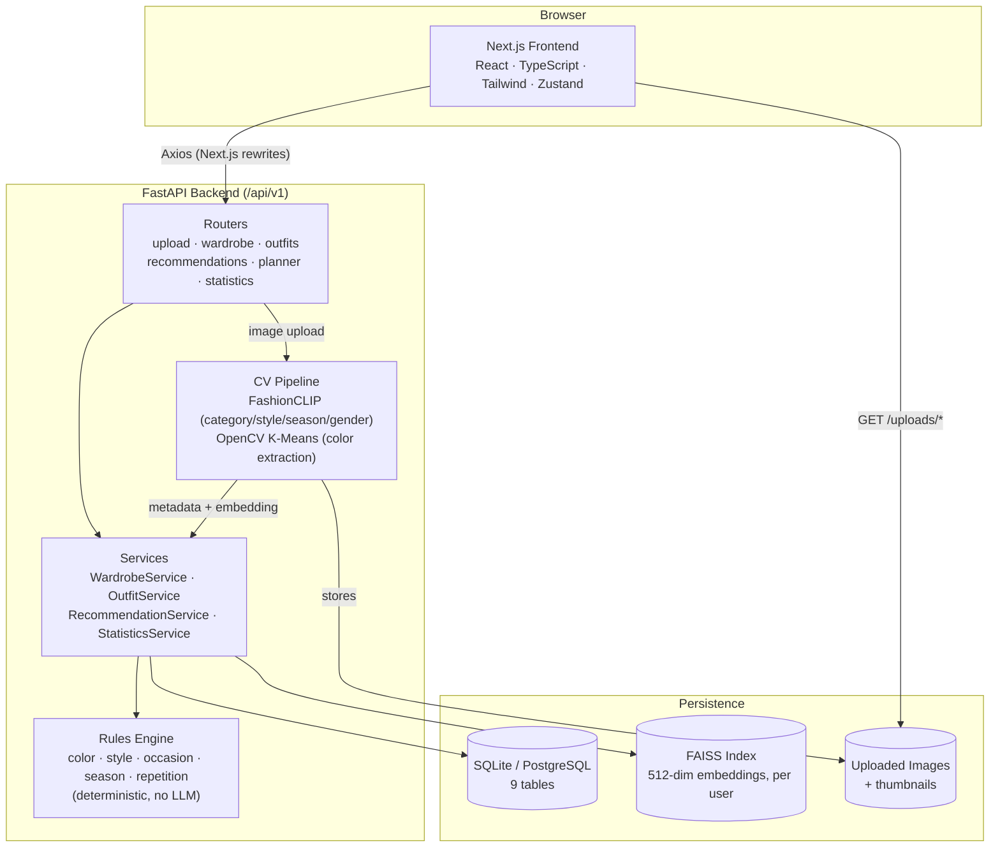
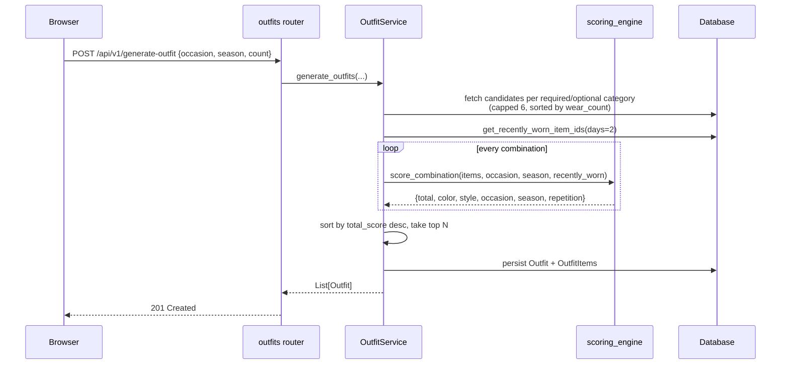

# Architecture

Vestia is a three-tier application: a Next.js frontend, a FastAPI backend
split into a computer-vision pipeline and a deterministic rules engine, and
a SQLite database (PostgreSQL-portable) paired with a FAISS vector index.

## System Diagram

## Layer Responsibilities

**Frontend (`frontend/src/`)**
Five pages — Dashboard, Wardrobe, Upload, Outfit Generator, Weekly Planner —
each backed by a Zustand store that calls a typed Axios client in
`services/`. In dev, `next.config.mjs` rewrites `/api/*` and `/uploads/*` to
the FastAPI backend, so the browser never needs CORS or a hardcoded host.

**Routers (`backend/app/routers/`)**
Thin HTTP layer. Each router maps one or more REST endpoints to a service
method and serializes the result through a Pydantic response model. No
business logic lives here.

**Services (`backend/app/services/`)**
Orchestration layer. `WardrobeService` handles CRUD and merges CV output
with user corrections. `OutfitService` builds candidate outfits (capped at
6 items per category, sorted by `wear_count` for variety) and scores them
via the rules engine. `RecommendationService` runs `OutfitService` once per
weekday with a 3-tier fallback to guarantee variety. `StatisticsService`
aggregates wardrobe counts.

**CV Pipeline (`backend/app/cv/`)**
`metadata_builder.py` orchestrates: `image_processor.py` (EXIF-correct,
square-pad to 512×512) → `fashion_clip.py` (zero-shot classification across
category/subcategory/style/pattern/season/gender + 512-dim embedding) →
`color_extractor.py` (OpenCV K-Means, background-masked, mapped to a
21-color named palette). `pipeline.py` falls back to `_stub.py` if
`torch`/`transformers` aren't installed — the app runs without a GPU.

**Rules Engine (`backend/app/rules/`)**
Five independent, unit-tested modules combined by `scoring_engine.py`:

| Module | Weight | What it scores |
|---|---|---|
| `color_rules.py` | 0.35 | Complementary / analogous / neutral color pairings |
| `style_rules.py` | 0.30 | Pairwise compatibility across 7 style categories |
| `occasion_rules.py` | 0.20 | Required categories + preferred styles per occasion |
| `season_rules.py` | 0.10 | Item season vs. target season |
| `repetition_rules.py` | 0.05 | Penalty for repeating yesterday's top/bottom |

No AI or LLM is involved in outfit selection — every score is a closed-form
function of item metadata.

**Persistence (`backend/app/database/`, `backend/app/faiss/`)**
SQLAlchemy ORM over SQLite (WAL mode, PRAGMA-tuned) with Alembic migrations;
swapping `DATABASE_URL` to a PostgreSQL DSN requires no code changes. FAISS
keeps one `IndexFlatL2` per user for similarity search, duplicate detection,
and K-Means wardrobe clustering — degrades gracefully (no-op) if
`faiss-cpu` isn't installed.

## Request Path Example: Outfit Generation

See [DATA_FLOW.md](./DATA_FLOW.md) for the upload and weekly-planning flows,
[DATABASE_SCHEMA.md](./DATABASE_SCHEMA.md) for the full ER diagram, and
[API.md](./API.md) for endpoint-level request/response contracts.
