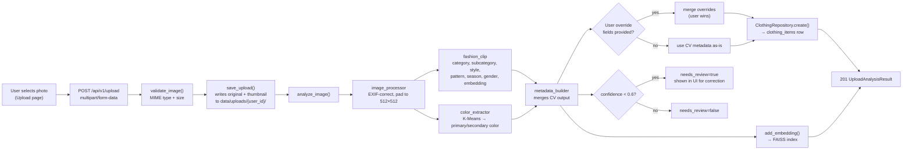
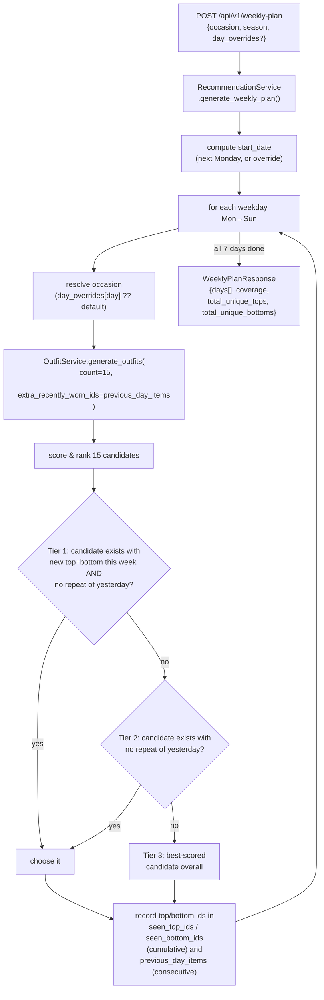
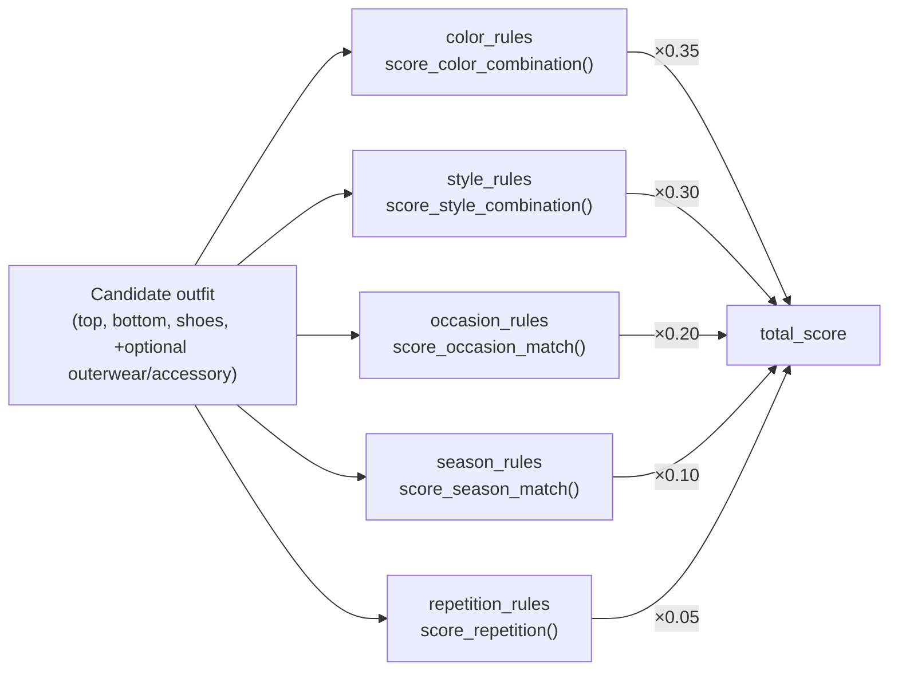

# Data Flow

## 1. Clothing Upload → Wardrobe

If `torch`/`transformers`/`faiss-cpu` aren't installed, `pipeline.py` and
`index_manager.py` degrade gracefully — the stub CV pipeline still returns
the full metadata shape (with `confidence=0.45`, always flagged for review),
and FAISS calls become no-ops.

## 2. Weekly Plan Generation

The three-tier fallback is what makes "no consecutive repeats" a practical
guarantee rather than just a scoring nudge: Tier 1 maximizes weekly variety,
Tier 2 relaxes to "at least not identical to yesterday," and Tier 3 only
fires when the wardrobe is too small to satisfy either (e.g. a single top).

## 3. Outfit Scoring (per candidate)

Each sub-score is 0.0–1.0 and computed independently — see
[ARCHITECTURE.md](./ARCHITECTURE.md#layer-responsibilities) for the rule
tables behind each module.
